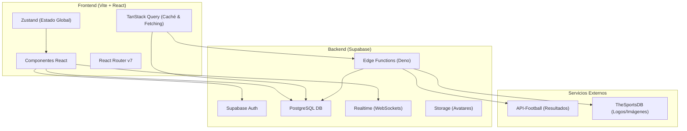
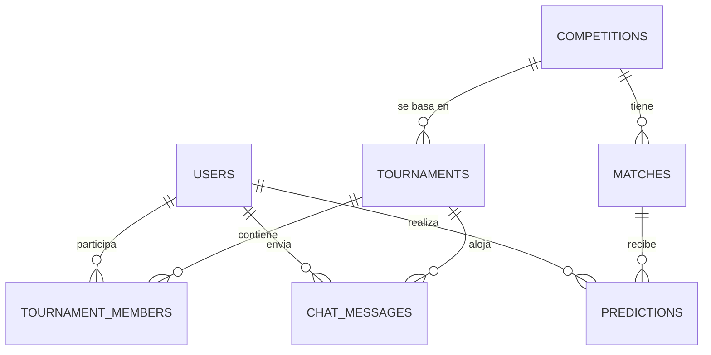
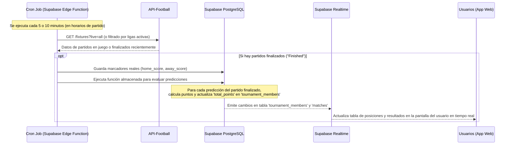

# Arquitectura de ProdeAR

Este documento detalla la arquitectura técnica, el modelo de datos y las especificaciones lógicas para **ProdeAR**, una aplicación web de pronósticos deportivos (prode) inspirada en el fútbol y la cultura futbolera argentina.

---

## 1. Visión General del Proyecto

ProdeAR permite a los usuarios competir en torneos de pronósticos deportivos con amigos y de manera global. El enfoque principal del MVP es proporcionar una experiencia interactiva, fluida y en tiempo real, priorizando la facilidad de uso y la automatización en la carga de resultados reales de los partidos.

### Características Clave del MVP (1.0)
1. **Autenticación**: Acceso simplificado mediante Google OAuth y correo electrónico/contraseña.
2. **Torneos Privados**: Creación de torneos limitados a una única competencia y un máximo de 50 participantes, con invitaciones por código o link corto.
3. **Pronósticos (Predicciones)**: Registro de marcadores estimados para partidos de fútbol y definición de ganador de tanda de penales en empates de playoffs.
4. **Lock de Pronósticos**: Bloqueo automático de edición al momento exacto del pitazo inicial de cada partido (0 minutos de gracia).
5. **Cálculo Automático (100% API)**: Sincronización automática de marcadores oficiales y cálculo serverless de puntos vía API (sin intervención de administradores).
6. **Chat de Torneo**: Canal de comunicación en tiempo real entre los participantes de cada torneo mediante WebSockets.
7. **Ranking y Estadísticas**: Tabla de posiciones en vivo calculada según el reglamento de ChampSheep con sistema de desempate integrado.
8. **Notificaciones Push**: Alertas directas en el navegador (goles, actualizaciones de ranking, avisos de cierre de fixture) utilizando Web Push.
9. **Soporte Multi-idioma (i18n)**: UI preparada con traducción nativa e inglés, utilizando español rioplatense (con voseo) por defecto.

---

## 2. Arquitectura de Software

La aplicación adoptará una arquitectura cliente-servidor desacoplada utilizando el patrón de Single Page Application (SPA) para el frontend y una plataforma Serverless/BaaS (Backend-as-a-Service) para el backend.



### Componentes del Stack
* **Vite + React**: Entorno de desarrollo ágil y librería de UI declarativa para una interfaz rápida y de alto rendimiento.
* **React Router v7**: Enrutamiento del lado del cliente para manejar la navegación interna sin recargar la página.
* **Zustand**: Manejador de estado global minimalista para gestionar la sesión de usuario y estados locales de la aplicación sin sobrecargar el DOM.
* **TanStack Query (React Query)**: Gestión eficiente del estado del servidor, almacenamiento en caché de fixtures y standings, sincronización en segundo plano y actualizaciones optimistas.
* **Supabase**:
  * **Auth**: Gestión de usuarios con JWT, inicio de sesión social (Google) y credenciales tradicionales.
  * **PostgreSQL**: Base de datos relacional para modelar de manera consistente las relaciones de torneos, predicciones y miembros.
  * **Realtime**: Conexión vía WebSockets para actualizar instantáneamente las tablas de posiciones y el chat de torneo.
  * **Edge Functions**: Funciones serverless ejecutadas mediante Deno para tareas programadas (cron jobs) como la sincronización de partidos.
* **API-Football**: Proveedor externo que proporciona datos precisos sobre fixtures, estados de partidos y marcadores en vivo de ligas argentinas e internacionales.

---

## 3. Modelo de Datos (Esquema Relacional)

La base de datos se implementará en PostgreSQL. A continuación, se presenta la estructura de las tablas principales y sus relaciones:



### Detalle de Tablas

#### USERS
Almacena la información de perfil de los usuarios autenticados.
* `id` (uuid, PK): Identificador único ligado a Supabase Auth.
* `email` (text, único): Correo electrónico del usuario.
* `display_name` (text): Nombre visible dentro de la plataforma (personalizable).
* `avatar_url` (text): URL de la imagen de perfil (puede apuntar a Supabase Storage o avatar de Google).
* `stats` (jsonb): Resumen de estadísticas del jugador (ej. `{"exact_hits": 10, "partial_hits": 25, "streak_current": 3, "streak_max": 5}`).
* `created_at` (timestamp): Fecha de registro.

#### COMPETITIONS
Ligas o torneos reales que los usuarios pueden pronosticar.
* `id` (int, PK): ID interno de la competencia.
* `name` (text): Nombre del torneo (ej. "Liga Profesional", "Copa Libertadores").
* `country` (text): País de procedencia (ej. "Argentina", "Internacional").
* `logo_url` (text): Enlace al escudo oficial de la competencia.
* `api_football_id` (int): ID de referencia en la API externa de fútbol.
* `season` (text): Temporada actual (ej. "2026").

#### TOURNAMENTS
Torneos privados organizados por los propios usuarios.
* `id` (uuid, PK): Identificador único del torneo privado.
* `owner_id` (uuid, FK -> USERS): Creador y administrador del torneo.
* `competition_id` (int, FK -> COMPETITIONS): Competencia en la que se basa el torneo.
* `name` (text): Nombre personalizado del torneo privado (ej. "Prode de la Oficina").
* `code` (text, único): Código alfanumérico corto (ej. `AR-9X2F`) usado para unirse.
* `invite_link` (text): URL generada para unirse directamente.
* `scoring_config` (jsonb): Reglas de puntajes específicas del torneo (ver sección 4).
* `status` (enum: 'active', 'finished'): Estado actual del torneo privado.
* `created_at` (timestamp): Fecha de creación.

#### TOURNAMENT_MEMBERS
Tabla intermedia que relaciona usuarios con torneos y guarda su desempeño en cada uno.
* `id` (uuid, PK): Identificador único de la membresía.
* `tournament_id` (uuid, FK -> TOURNAMENTS): Torneo asociado.
* `user_id` (uuid, FK -> USERS): Usuario participante.
* `total_points` (int): Puntos acumulados en este torneo.
* `rank` (int): Posición actual en la tabla del torneo.
* `role` (enum: 'admin', 'player'): Rol dentro del torneo (el creador es admin).
* `joined_at` (timestamp): Fecha en que se unió.
* *Restricción de Negocio*: Se valida mediante un trigger de base de datos que el número total de miembros por torneo no exceda los **50 usuarios**.

#### MATCHES
Partidos reales correspondientes a las competencias activas. Sincronizados vía API.
* `id` (uuid, PK): ID único del partido en la base de datos de ProdeAR.
* `competition_id` (int, FK -> COMPETITIONS): Competencia a la que pertenece.
* `api_match_id` (int, único): ID único del partido en la API de fútbol.
* `home_team` (text): Nombre del equipo local.
* `away_team` (text): Nombre del equipo visitante.
* `home_logo` (text): URL del escudo del equipo local.
* `away_logo` (text): URL del escudo del equipo visitante.
* `matchday` (int): Número de fecha o jornada (ej. Fecha 14).
* `kick_off` (timestamp): Fecha y hora programada del inicio del partido.
* `home_score` (int, nullable): Goles convertidos por el local en tiempo reglamentario.
* `away_score` (int, nullable): Goles convertidos por el visitante en tiempo reglamentario.
* `penalty_winner` (text, nullable): Ganador de la tanda de penales si aplica (ej. 'home' o 'away').
* `status` (text): Estado del partido (ej. "Not Started", "First Half", "Finished").

#### PREDICTIONS
Pronósticos individuales de los usuarios para cada partido de un torneo específico.
* `id` (uuid, PK): Identificador único del pronóstico.
* `match_id` (uuid, FK -> MATCHES): Partido pronosticado.
* `user_id` (uuid, FK -> USERS): Usuario que realiza la predicción.
* `tournament_id` (uuid, FK -> TOURNAMENTS): Torneo en el que compite con esta predicción.
* `predicted_home` (int): Goles estimados para el local.
* `predicted_away` (int): Goles estimados para el visitante.
* `predicted_winner` (text, nullable): Equipo predicho para ganar la tanda de penales si el usuario predijo un empate en playoffs ('home' o 'away').
* `points_earned` (int, nullable): Puntos obtenidos por esta predicción (nulo hasta que termine el partido).
* `created_at` (timestamp): Fecha de carga/modificación del pronóstico.

#### CHAT_MESSAGES
Historial de mensajes de chat en tiempo real por torneo.
* `id` (uuid, PK): Identificador del mensaje.
* `tournament_id` (uuid, FK -> TOURNAMENTS): Canal de chat al que pertenece.
* `user_id` (uuid, FK -> USERS): Remitente del mensaje.
* `content` (text## 4. Reglas del Juego y Lógica de Puntuación (Reglamento Oficial ChampSheep)

El MVP 1.0 de ProdeAR adopta el reglamento oficial de ChampSheep de forma fija. Se desestiman las rachas de puntos y las personalizaciones por torneo para agilizar la entrega del MVP y asegurar la estabilidad competitiva.

### 1. Puntos Base por Partido
El cálculo de puntos de cada partido finalizado evalúa el acierto de goles reglamentarios (90 o 120 minutos, excluyendo penales):
* **Marcador Exacto (+10 pts)**: El usuario acertó exactamente la cantidad de goles de ambos equipos.
  * *Ejemplo*: Predice `2 - 1`, Resultado `2 - 1`.
* **Diferencia de Goles (+6 pts)**: El usuario acertó quién ganó (o empate) y la diferencia de goles exacta (pero no el marcador).
  * *Ejemplo*: Predice `2 - 1` (+1 de diferencia), Resultado `3 - 2` (+1 de diferencia). O predice `1 - 1` (0 de diferencia) y sale `0 - 0` (0 de diferencia).
* **Resultado Básico (+3 pts)**: El usuario acertó el ganador (o empate) pero la diferencia no coincide.
  * *Ejemplo*: Predice `2 - 0`, Resultado `3 - 0` (el usuario acertó ganador local, pero la diferencia no coincide; por ende obtiene +3 puntos).
* **Bono por Penales (+4 pts)**: En partidos de eliminación directa, si el partido termina en empate en tiempo de juego reglamentario, se evalúa quién acertó la selección que ganó por penales (vía campo `predicted_winner` contra `penalty_winner`).

### 2. Multiplicador por Etapa
Para mantener la emoción en los tramos decisivos, los puntos base del partido se multiplican según la etapa en la que se dispute:
* **Fase de Grupos**: $\times 1$
* **Dieciseisavos de final (R32)**: $\times 2$
* **Octavos de final (R16)**: $\times 3$
* **Cuartos de final**: $\times 4$
* **Semifinales**: $\times 5$
* **Tercer Puesto**: $\times 4$
* **Final**: $\times 6$

### 3. Bonos de Avance de Etapa (Brackets)
Se otorgan puntos fijos acumulativos por cada equipo que avance físicamente en el torneo real (evaluado automáticamente por el motor al cerrarse la fase):
* Clasifica de fase de grupos: **+2 pts** por equipo clasificado.
* Avanza de dieciseisavos: **+4 pts** por equipo.
* Avanza de octavos: **+6 pts** por equipo.
* Avanza de cuartos de final: **+10 pts** por equipo.
* Avanza de semifinales: **+16 pts** por equipo.
* Tercer Puesto: **+26 pts** por equipo.
* Campeón del Torneo: **+34 pts** por equipo.

### Criterio de Desempate en Rankings
Si dos o más participantes de un torneo tienen la misma puntuación total (`total_points`), la posición relativa en el ranking se determinará bajo el siguiente orden de criterios:
1. **Mayor cantidad de Marcadores Exactos** (+10 base) acertados.
2. **Mayor cantidad de Diferencia de Goles** (+6 base) acertadas.
3. **Mayor cantidad de Resultados Básicos** (+3 base) acertados.
4. **Fecha de ingreso al torneo** (el usuario que se unió antes tiene prioridad).

### Lógica de Cierre (Locking) de Pronósticos
* Los pronósticos de un partido se cierran de manera estricta **al momento del inicio oficial** del partido (`kick_off`), con 0 minutos de gracia.
* La base de datos implementa políticas que impiden la inserción o modificación de registros en `PREDICTIONS` si `NOW() >= kick_off`.
* En la interfaz de usuario, los campos de carga se deshabilitarán automáticamente y mostrarán un icono de candado.

---

## 5. Sincronización de Datos e Integración de APIs

El sistema depende de datos dinámicos actualizados. Para evitar exceder los límites de llamadas de la API de fútbol, se implementará un flujo optimizado mediante caché y tareas programadas en Supabase.

### Estrategia de APIs
* **Proveedor Principal (API-Football)**:
  * Utilizado para obtener calendarios de partidos (fixtures), información de equipos, clasificaciones de ligas y marcadores finales de partidos finalizados.
  * Plan inicial: Free tier (100 req/día) durante el desarrollo. Escalado a Plan Pro ($19/mes, 7500 req/día) para producción.
  * Cobertura confirmada: Liga Profesional de Fútbol (Argentina), Copa de la Liga, Copa Libertadores, UEFA Champions League y Copa Mundial de la FIFA 2026.
* **Proveedor Suplementario (TheSportsDB)**:
  * Utilizado de forma gratuita para almacenar y servir las URLs de los escudos oficiales de los equipos en alta definición, reduciendo la carga y dependencia de API-Football.

### Ciclo de Sincronización Serverless (Edge Functions)
Para mantener actualizados los resultados de los partidos y calcular los puntos sin intervención manual:



1. **Planificación de Tareas (Cron)**: Se configura una Edge Function programada en Supabase que se ejecuta con mayor frecuencia en la franja horaria donde hay partidos activos (ej. cada 5 minutos los fines de semana y cada 1 hora en días sin actividad programada).
2. **Actualización de Marcadores (`poll-scores`)**:
   - La Edge Function se encuentra en `/supabase/functions/poll-scores/index.ts`.
   - Consulta el endpoint `/fixtures` de API-Football, admitiendo filtros por parámetro (ej. `?live=all` o `?league=X&season=Y`).
   - Requiere la variable de entorno `API_FOOTBALL_KEY` (cabecera `x-apisports-key`) configurada en el panel de Supabase.
   - Utiliza la clave de rol de servicio (`SUPABASE_SERVICE_ROLE_KEY`) para realizar inserciones/actualizaciones en la tabla `matches` de Supabase superando las políticas RLS.
3. **Cálculo y Distribución de Puntos**: Una vez guardado el resultado de un partido (cambio de status a `finished`), el trigger `trigger_update_points_on_match_finished` ejecuta la función `proc_calculate_points_on_match_finish()`. Esta función procesa todas las predicciones asociadas, calcula los puntos con `calculate_match_points()`, actualiza `total_points` de los miembros del torneo y recalcula los rangos de todos los participantes afectados.
4. **Actualización de Rankings**: Las tablas de posiciones se recalculan de forma relacional y automática siguiendo el criterio ChampSheep.
5. **Realtime Broadcast**: Supabase Realtime detecta los cambios en `tournament_members` y transmite los nuevos rankings a todas las aplicaciones cliente activas vía WebSockets, permitiendo ver los cambios en la tabla de posiciones inmediatamente.

### 5.1. Directiva de Integridad de Esquema DB vs API (Buenas Prácticas)
Para evitar errores de discrepancia de esquema en producción (típicos fallos donde la API-Football u otra API externa provee nuevos campos que la base de datos de Supabase no soporta):
* **Checklist de Nuevos Campos**: Antes de modificar una Edge Function para leer o guardar campos adicionales de la API, se debe verificar que dichos campos existan en el esquema de la base de datos local y remota de Supabase.
* **Script de Alteración de Tablas**: Si se requiere un nuevo campo, se debe generar un script de migración SQL (`ALTER TABLE ... ADD COLUMN ...`) y ejecutarlo en el panel de Supabase.
* **Refrescar PostgREST**: Al agregar columnas a una tabla en Supabase, es necesario refrescar el esquema de la API para que PostgREST y Deno lo reconozcan. Esto se puede lograr ejecutando en la consola SQL de Supabase:
  ```sql
  NOTIFY pgrst, 'reload schema';
  ```
* **Validación de Logs**: Posterior a la sincronización o deploy, se deben revisar siempre los logs de la Edge Function en Supabase Dashboard buscando posibles advertencias de tipo `Could not find the '...' column of '...' in the schema cache` para actuar de inmediato.

---

## 6. Seguridad y Permisos (RLS - Row Level Security)

PostgreSQL en Supabase permite aplicar seguridad a nivel de fila (Row Level Security). Esto garantiza que un usuario no pueda alterar datos ajenos ni leer información privada de otros torneos.

* **Tabla USERS**: Un usuario solo puede modificar su propio perfil (`auth.uid() = id`). Todos los usuarios autenticados pueden leer los perfiles de otros para mostrar nombres y avatares en las tablas de posiciones.
* **Tabla TOURNAMENTS**: Lectura pública o limitada a usuarios que conozcan el código. Solo el creador (`owner_id = auth.uid()`) puede editar el nombre, las reglas de puntuación o finalizar el torneo.
* **Tabla TOURNAMENT_MEMBERS**: Un usuario puede agregarse a sí mismo a un torneo si tiene el código correspondiente. No puede modificar los puntajes directamente.
* **Tabla PREDICTIONS**: Un usuario solo puede crear o editar sus propias predicciones (`user_id = auth.uid()`).
  * *Seguridad del Prode*: Un usuario **no puede leer** las predicciones de otros usuarios para un partido específico hasta que falten 15 minutos para el inicio del partido (lock) o hasta que el partido comience. Esto evita el plagio de pronósticos.
* **Tabla CHAT_MESSAGES**: Solo los usuarios que son miembros activos del torneo (`tournament_id` presente en sus membresías de torneo) pueden leer y enviar mensajes de chat en ese torneo.

---

## 7. Decisiones de Arquitectura Confirmadas

1. **Límite de miembros por torneo**: Estrictamente **hasta 50 miembros** por torneo privado para garantizar un rendimiento óptimo de las consultas en vivo de Supabase.
2. **Competencia única**: Los torneos privados se vinculan a **una sola competencia** real (ej. Copa Mundial de la FIFA 2026). No existen torneos híbridos o multi-competencia.
3. **Carga automatizada**: Sincronización e ingreso de marcadores 100% dependiente de API-Football (sin edición manual de administradores en DB), garantizando la imparcialidad.
4. **Notificaciones Push y PWA**: Soporte nativo para Web Push (utilizando el Service Worker del navegador y la librería `web-push-neo`) desde el día 1, configurado para avisar actualizaciones de tabla y recordatorios de fechas.
5. **Internacionalización**: Código base internacionalizado desde el setup inicial (i18n), con traducciones cargadas para español argentino (voseo) por defecto.
6. **Sistema de desempate ChampSheep**: Tabla ordenada de manera automática por puntos acumulados. En empates, se define sucesivamente por mayor cantidad de aciertos exactos, mayor cantidad de diferencias acertadas y, finalmente, por mayor antigüedad del usuario en el torneo.
7. **Reglamento Fijo**: Implementación nativa y fija del sistema de puntos **10 / 6 / 3** (base), multiplicadores por etapa del fixture y bonos por tanda de penales (+4) y avance en brackets.
8. **Funcionalidades diferidas a la Versión 2.0 (Backlog)**:
   * Simulador de posiciones interactivo (Standings en base a picks de partidos futuros).
   * Visualizador dinámico de brackets (diagrama de playoffs interactivo).
   * Bonos por madrugar (Early Picks) y por completar a tiempo la fecha.
   * Predicción a largo plazo de Goleador de Torneo.
