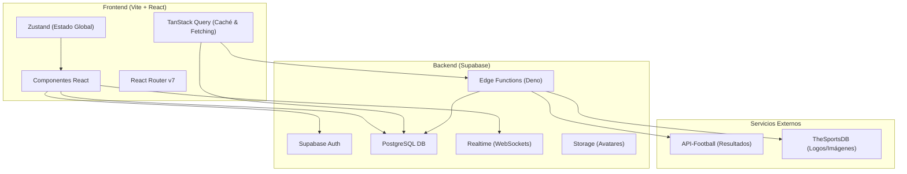
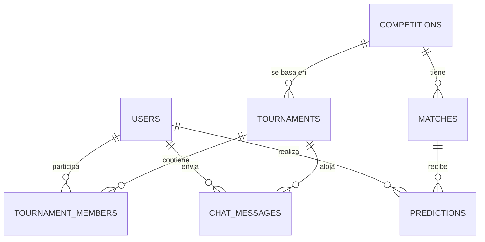
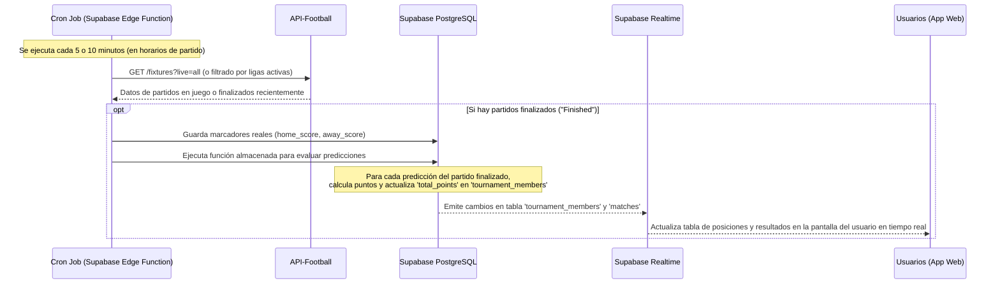

# Arquitectura de ProdeAR

Este documento detalla la arquitectura técnica, el modelo de datos y las especificaciones lógicas para **ProdeAR**, una aplicación web de pronósticos deportivos (prode) inspirada en el fútbol y la cultura futbolera argentina.

---

## 1. Visión General del Proyecto

ProdeAR permite a los usuarios competir en torneos de pronósticos deportivos con amigos y de manera global. El enfoque principal del MVP es proporcionar una experiencia interactiva, fluida y en tiempo real, priorizando la facilidad de uso y la automatización en la carga de resultados reales de los partidos.

### Características Clave del MVP (1.0)
1. **Autenticación**: Acceso simplificado mediante Google OAuth y correo electrónico/contraseña.
2. **Torneos Privados**: Creación de torneos limitados a una única competencia y un máximo de 50 participantes, con invitaciones por código o link corto.
3. **Pronósticos (Predicciones)**: Registro de marcadores estimados para partidos de fútbol y definición de ganador de tanda de penales en empates de playoffs.
4. **Lock de Pronósticos**: Bloqueo automático de edición al momento exacto del pitazo inicial de cada partido (0 minutos de gracia).
5. **Cálculo Automático (100% API)**: Sincronización automática de marcadores oficiales y cálculo serverless de puntos vía API (sin intervención de administradores).
6. **Chat de Torneo**: Canal de comunicación en tiempo real entre los participantes de cada torneo mediante WebSockets.
7. **Ranking y Estadísticas**: Tabla de posiciones en vivo calculada según el reglamento de ChampSheep con sistema de desempate integrado.
8. **Notificaciones Push**: Alertas directas en el navegador (goles, actualizaciones de ranking, avisos de cierre de fixture) utilizando Web Push.
9. **Soporte Multi-idioma (i18n)**: UI preparada con traducción nativa e inglés, utilizando español rioplatense (con voseo) por defecto.

---

## 2. Arquitectura de Software

La aplicación adoptará una arquitectura cliente-servidor desacoplada utilizando el patrón de Single Page Application (SPA) para el frontend y una plataforma Serverless/BaaS (Backend-as-a-Service) para el backend.



### Componentes del Stack
* **Vite + React**: Entorno de desarrollo ágil y librería de UI declarativa para una interfaz rápida y de alto rendimiento.
* **React Router v7**: Enrutamiento del lado del cliente para manejar la navegación interna sin recargar la página.
* **Zustand**: Manejador de estado global minimalista para gestionar la sesión de usuario y estados locales de la aplicación sin sobrecargar el DOM.
* **TanStack Query (React Query)**: Gestión eficiente del estado del servidor, almacenamiento en caché de fixtures y standings, sincronización en segundo plano y actualizaciones optimistas.
* **Supabase**:
  * **Auth**: Gestión de usuarios con JWT, inicio de sesión social (Google) y credenciales tradicionales.
  * **PostgreSQL**: Base de datos relacional para modelar de manera consistente las relaciones de torneos, predicciones y miembros.
  * **Realtime**: Conexión vía WebSockets para actualizar instantáneamente las tablas de posiciones y el chat de torneo.
  * **Edge Functions**: Funciones serverless ejecutadas mediante Deno para tareas programadas (cron jobs) como la sincronización de partidos.
* **API-Football**: Proveedor externo que proporciona datos precisos sobre fixtures, estados de partidos y marcadores en vivo de ligas argentinas e internacionales.

---

## 3. Modelo de Datos (Esquema Relacional)

La base de datos se implementará en PostgreSQL. A continuación, se presenta la estructura de las tablas principales y sus relaciones:



### Detalle de Tablas

#### USERS
Almacena la información de perfil de los usuarios autenticados.
* `id` (uuid, PK): Identificador único ligado a Supabase Auth.
* `email` (text, único): Correo electrónico del usuario.
* `display_name` (text): Nombre visible dentro de la plataforma (personalizable).
* `avatar_url` (text): URL de la imagen de perfil (puede apuntar a Supabase Storage o avatar de Google).
* `stats` (jsonb): Resumen de estadísticas del jugador (ej. `{"exact_hits": 10, "partial_hits": 25, "streak_current": 3, "streak_max": 5}`).
* `created_at` (timestamp): Fecha de registro.

#### COMPETITIONS
Ligas o torneos reales que los usuarios pueden pronosticar.
* `id` (int, PK): ID interno de la competencia.
* `name` (text): Nombre del torneo (ej. "Liga Profesional", "Copa Libertadores").
* `country` (text): País de procedencia (ej. "Argentina", "Internacional").
* `logo_url` (text): Enlace al escudo oficial de la competencia.
* `api_football_id` (int): ID de referencia en la API externa de fútbol.
* `season` (text): Temporada actual (ej. "2026").

#### TOURNAMENTS
Torneos privados organizados por los propios usuarios.
* `id` (uuid, PK): Identificador único del torneo privado.
* `owner_id` (uuid, FK -> USERS): Creador y administrador del torneo.
* `competition_id` (int, FK -> COMPETITIONS): Competencia en la que se basa el torneo.
* `name` (text): Nombre personalizado del torneo privado (ej. "Prode de la Oficina").
* `code` (text, único): Código alfanumérico corto (ej. `AR-9X2F`) usado para unirse.
* `invite_link` (text): URL generada para unirse directamente.
* `scoring_config` (jsonb): Reglas de puntajes específicas del torneo (ver sección 4).
* `status` (enum: 'active', 'finished'): Estado actual del torneo privado.
* `created_at` (timestamp): Fecha de creación.

#### TOURNAMENT_MEMBERS
Tabla intermedia que relaciona usuarios con torneos y guarda su desempeño en cada uno.
* `id` (uuid, PK): Identificador único de la membresía.
* `tournament_id` (uuid, FK -> TOURNAMENTS): Torneo asociado.
* `user_id` (uuid, FK -> USERS): Usuario participante.
* `total_points` (int): Puntos acumulados en este torneo.
* `rank` (int): Posición actual en la tabla del torneo.
* `role` (enum: 'admin', 'player'): Rol dentro del torneo (el creador es admin).
* `joined_at` (timestamp): Fecha en que se unió.
* *Restricción de Negocio*: Se valida mediante un trigger de base de datos que el número total de miembros por torneo no exceda los **50 usuarios**.

#### MATCHES
Partidos reales correspondientes a las competencias activas. Sincronizados vía API.
* `id` (uuid, PK): ID único del partido en la base de datos de ProdeAR.
* `competition_id` (int, FK -> COMPETITIONS): Competencia a la que pertenece.
* `api_match_id` (int, único): ID único del partido en la API de fútbol.
* `home_team` (text): Nombre del equipo local.
* `away_team` (text): Nombre del equipo visitante.
* `home_logo` (text): URL del escudo del equipo local.
* `away_logo` (text): URL del escudo del equipo visitante.
* `matchday` (int): Número de fecha o jornada (ej. Fecha 14).
* `kick_off` (timestamp): Fecha y hora programada del inicio del partido.
* `home_score` (int, nullable): Goles convertidos por el local en tiempo reglamentario.
* `away_score` (int, nullable): Goles convertidos por el visitante en tiempo reglamentario.
* `penalty_winner` (text, nullable): Ganador de la tanda de penales si aplica (ej. 'home' o 'away').
* `status` (text): Estado del partido (ej. "Not Started", "First Half", "Finished").

#### PREDICTIONS
Pronósticos individuales de los usuarios para cada partido de un torneo específico.
* `id` (uuid, PK): Identificador único del pronóstico.
* `match_id` (uuid, FK -> MATCHES): Partido pronosticado.
* `user_id` (uuid, FK -> USERS): Usuario que realiza la predicción.
* `tournament_id` (uuid, FK -> TOURNAMENTS): Torneo en el que compite con esta predicción.
* `predicted_home` (int): Goles estimados para el local.
* `predicted_away` (int): Goles estimados para el visitante.
* `predicted_winner` (text, nullable): Equipo predicho para ganar la tanda de penales si el usuario predijo un empate en playoffs ('home' o 'away').
* `points_earned` (int, nullable): Puntos obtenidos por esta predicción (nulo hasta que termine el partido).
* `created_at` (timestamp): Fecha de carga/modificación del pronóstico.

#### CHAT_MESSAGES
Historial de mensajes de chat en tiempo real por torneo.
* `id` (uuid, PK): Identificador del mensaje.
* `tournament_id` (uuid, FK -> TOURNAMENTS): Canal de chat al que pertenece.
* `user_id` (uuid, FK -> USERS): Remitente del mensaje.
* `content` (text## 4. Reglas del Juego y Lógica de Puntuación (Reglamento Oficial ChampSheep)

El MVP 1.0 de ProdeAR adopta el reglamento oficial de ChampSheep de forma fija. Se desestiman las rachas de puntos y las personalizaciones por torneo para agilizar la entrega del MVP y asegurar la estabilidad competitiva.

### 1. Puntos Base por Partido
El cálculo de puntos de cada partido finalizado evalúa el acierto de goles reglamentarios (90 o 120 minutos, excluyendo penales):
* **Marcador Exacto (+10 pts)**: El usuario acertó exactamente la cantidad de goles de ambos equipos.
  * *Ejemplo*: Predice `2 - 1`, Resultado `2 - 1`.
* **Diferencia de Goles (+6 pts)**: El usuario acertó quién ganó (o empate) y la diferencia de goles exacta (pero no el marcador).
  * *Ejemplo*: Predice `2 - 1` (+1 de diferencia), Resultado `3 - 2` (+1 de diferencia). O predice `1 - 1` (0 de diferencia) y sale `0 - 0` (0 de diferencia).
* **Resultado Básico (+3 pts)**: El usuario acertó el ganador (o empate) pero la diferencia no coincide.
  * *Ejemplo*: Predice `2 - 0`, Resultado `3 - 0` (el usuario acertó ganador local, pero la diferencia no coincide; por ende obtiene +3 puntos).
* **Bono por Penales (+4 pts)**: En partidos de eliminación directa, si el partido termina en empate en tiempo de juego reglamentario, se evalúa quién acertó la selección que ganó por penales (vía campo `predicted_winner` contra `penalty_winner`).

### 2. Multiplicador por Etapa
Para mantener la emoción en los tramos decisivos, los puntos base del partido se multiplican según la etapa en la que se dispute:
* **Fase de Grupos**: $\times 1$
* **Dieciseisavos de final (R32)**: $\times 2$
* **Octavos de final (R16)**: $\times 3$
* **Cuartos de final**: $\times 4$
* **Semifinales**: $\times 5$
* **Tercer Puesto**: $\times 4$
* **Final**: $\times 6$

### 3. Bonos de Avance de Etapa (Brackets)
Se otorgan puntos fijos acumulativos por cada equipo que avance físicamente en el torneo real (evaluado automáticamente por el motor al cerrarse la fase):
* Clasifica de fase de grupos: **+2 pts** por equipo clasificado.
* Avanza de dieciseisavos: **+4 pts** por equipo.
* Avanza de octavos: **+6 pts** por equipo.
* Avanza de cuartos de final: **+10 pts** por equipo.
* Avanza de semifinales: **+16 pts** por equipo.
* Tercer Puesto: **+26 pts** por equipo.
* Campeón del Torneo: **+34 pts** por equipo.

### Criterio de Desempate en Rankings
Si dos o más participantes de un torneo tienen la misma puntuación total (`total_points`), la posición relativa en el ranking se determinará bajo el siguiente orden de criterios:
1. **Mayor cantidad de Marcadores Exactos** (+10 base) acertados.
2. **Mayor cantidad de Diferencia de Goles** (+6 base) acertadas.
3. **Mayor cantidad de Resultados Básicos** (+3 base) acertados.
4. **Fecha de ingreso al torneo** (el usuario que se unió antes tiene prioridad).

### Lógica de Cierre (Locking) de Pronósticos
* Los pronósticos de un partido se cierran de manera estricta **al momento del inicio oficial** del partido (`kick_off`), con 0 minutos de gracia.
* La base de datos implementa políticas que impiden la inserción o modificación de registros en `PREDICTIONS` si `NOW() >= kick_off`.
* En la interfaz de usuario, los campos de carga se deshabilitarán automáticamente y mostrarán un icono de candado.

---

## 5. Sincronización de Datos e Integración de APIs

El sistema depende de datos dinámicos actualizados. Para evitar exceder los límites de llamadas de la API de fútbol, se implementará un flujo optimizado mediante caché y tareas programadas en Supabase.

### Estrategia de APIs
* **Proveedor Principal (API-Football)**:
  * Utilizado para obtener calendarios de partidos (fixtures), información de equipos, clasificaciones de ligas y marcadores finales de partidos finalizados.
  * Plan inicial: Free tier (100 req/día) durante el desarrollo. Escalado a Plan Pro ($19/mes, 7500 req/día) para producción.
  * Cobertura confirmada: Liga Profesional de Fútbol (Argentina), Copa de la Liga, Copa Libertadores, UEFA Champions League y Copa Mundial de la FIFA 2026.
* **Proveedor Suplementario (TheSportsDB)**:
  * Utilizado de forma gratuita para almacenar y servir las URLs de los escudos oficiales de los equipos en alta definición, reduciendo la carga y dependencia de API-Football.

### Ciclo de Sincronización Serverless (Edge Functions)
Para mantener actualizados los resultados de los partidos y calcular los puntos sin intervención manual:



1. **Planificación de Tareas (Cron)**: Se configura una Edge Function programada en Supabase que se ejecuta con mayor frecuencia en la franja horaria donde hay partidos activos (ej. cada 5 minutos los fines de semana y cada 1 hora en días sin actividad programada).
2. **Actualización de Marcadores (`poll-scores`)**:
   - La Edge Function se encuentra en `/supabase/functions/poll-scores/index.ts`.
   - Consulta el endpoint `/fixtures` de API-Football, admitiendo filtros por parámetro (ej. `?live=all` o `?league=X&season=Y`).
   - Requiere la variable de entorno `API_FOOTBALL_KEY` (cabecera `x-apisports-key`) configurada en el panel de Supabase.
   - Utiliza la clave de rol de servicio (`SUPABASE_SERVICE_ROLE_KEY`) para realizar inserciones/actualizaciones en la tabla `matches` de Supabase superando las políticas RLS.
3. **Cálculo y Distribución de Puntos**: Una vez guardado el resultado de un partido (cambio de status a `finished`), el trigger `trigger_update_points_on_match_finished` ejecuta la función `proc_calculate_points_on_match_finish()`. Esta función procesa todas las predicciones asociadas, calcula los puntos con `calculate_match_points()`, actualiza `total_points` de los miembros del torneo y recalcula los rangos de todos los participantes afectados.
4. **Actualización de Rankings**: Las tablas de posiciones se recalculan de forma relacional y automática siguiendo el criterio ChampSheep.
5. **Realtime Broadcast**: Supabase Realtime detecta los cambios en `tournament_members` y transmite los nuevos rankings a todas las aplicaciones cliente activas vía WebSockets, permitiendo ver los cambios en la tabla de posiciones inmediatamente.

### 5.1. Directiva de Integridad de Esquema DB vs API (Buenas Prácticas)
Para evitar errores de discrepancia de esquema en producción (típicos fallos donde la API-Football u otra API externa provee nuevos campos que la base de datos de Supabase no soporta):
* **Checklist de Nuevos Campos**: Antes de modificar una Edge Function para leer o guardar campos adicionales de la API, se debe verificar que dichos campos existan en el esquema de la base de datos local y remota de Supabase.
* **Script de Alteración de Tablas**: Si se requiere un nuevo campo, se debe generar un script de migración SQL (`ALTER TABLE ... ADD COLUMN ...`) y ejecutarlo en el panel de Supabase.
* **Refrescar PostgREST**: Al agregar columnas a una tabla en Supabase, es necesario refrescar el esquema de la API para que PostgREST y Deno lo reconozcan. Esto se puede lograr ejecutando en la consola SQL de Supabase:
  ```sql
  NOTIFY pgrst, 'reload schema';
  ```
* **Validación de Logs**: Posterior a la sincronización o deploy, se deben revisar siempre los logs de la Edge Function en Supabase Dashboard buscando posibles advertencias de tipo `Could not find the '...' column of '...' in the schema cache` para actuar de inmediato.

---

## 6. Seguridad y Permisos (RLS - Row Level Security)

PostgreSQL en Supabase permite aplicar seguridad a nivel de fila (Row Level Security). Esto garantiza que un usuario no pueda alterar datos ajenos ni leer información privada de otros torneos.

* **Tabla USERS**: Un usuario solo puede modificar su propio perfil (`auth.uid() = id`). Todos los usuarios autenticados pueden leer los perfiles de otros para mostrar nombres y avatares en las tablas de posiciones.
* **Tabla TOURNAMENTS**: Lectura pública para cualquier usuario autenticado (para permitir buscar la información del torneo antes de unirse y evitar bloqueos de RLS). Únicamente el creador/administrador (`owner_id = auth.uid()`) tiene permisos para editar el nombre o eliminar el torneo.
* **Tabla TOURNAMENT_MEMBERS**: Un usuario puede agregarse a sí mismo a un torneo si tiene el código correspondiente. Solo el propio participante o el creador del torneo pueden eliminar una fila de membresía (desvinculación o expulsión).
  * *Borrado en cascada*: La eliminación de una membresía ejecuta el trigger `trigger_delete_predictions_on_member_leave` que borra automáticamente todos los pronósticos del usuario correspondientes a ese torneo para evitar registros huérfanos.
* **Tabla PREDICTIONS**: Un usuario solo puede crear o editar sus propias predicciones (`user_id = auth.uid()`).
  * *Seguridad del Prode*: Un usuario **no puede leer** las predicciones de otros usuarios para un partido específico hasta que falten 15 minutos para el inicio del partido (lock) o hasta que el partido comience. Esto evita el plagio de pronósticos.
* **Tabla CHAT_MESSAGES**: Solo los usuarios que son miembros activos del torneo (`tournament_id` presente en sus membresías de torneo) pueden leer y enviar mensajes de chat en ese torneo.

---

## 7. Decisiones de Arquitectura Confirmadas

1. **Límite de miembros por torneo**: Estrictamente **hasta 50 miembros** por torneo privado para garantizar un rendimiento óptimo de las consultas en vivo de Supabase.
2. **Competencia única**: Los torneos privados se vinculan a **una sola competencia** real (ej. Copa Mundial de la FIFA 2026). No existen torneos híbridos o multi-competencia.
3. **Carga automatizada**: Sincronización e ingreso de marcadores 100% dependiente de API-Football (sin edición manual de administradores en DB), garantizando la imparcialidad.
4. **Notificaciones Push y PWA**: Soporte nativo para Web Push (utilizando el Service Worker del navegador y la librería `web-push-neo`) desde el día 1, configurado para avisar actualizaciones de tabla y recordatorios de fechas.
5. **Internacionalización**: Código base internacionalizado desde el setup inicial (i18n), con traducciones cargadas para español argentino (voseo) por defecto.
6. **Sistema de desempate ChampSheep**: Tabla ordenada de manera automática por puntos acumulados. En empates, se define sucesivamente por mayor cantidad de aciertos exactos, mayor cantidad de diferencias acertadas y, finalmente, por mayor antigüedad del usuario en el torneo.
7. **Reglamento Fijo**: Implementación nativa y fija del sistema de puntos **10 / 6 / 3** (base), multiplicadores por etapa del fixture y bonos por tanda de penales (+4) y avance en brackets.
8. **Funcionalidades diferidas a la Versión 2.0 (Backlog)**:
   * Simulador de posiciones interactivo (Standings en base a picks de partidos futuros).
   * Visualizador dinámico de brackets (diagrama de playoffs interactivo).
   * Bonos por madrugar (Early Picks) y por completar a tiempo la fecha.
   * Predicción a largo plazo de Goleador de Torneo.

### Patrones de implementación establecidos *(2026-06-12)*

9. **Bottom Sheet genérico para overlays mobile-first** (`src/components/ui/BottomSheet.tsx`): Componente reutilizable con portal a `document.body`, focus trap, Escape handler, swipe-down gesture, body scroll lock, safe-area iOS. Animación CSS pura (sin librerías como framer-motion). Responsive: en `md+` se transforma en modal centrado. Usado por `StatsSheet` (Captain Stats) y `MatchSheet` (detalle de partido).

10. **Funciones puras + hooks reactivos wrappers**: Toda lógica de derivación de estado (ej. `deriveMatchCardState`, `deriveEmptyStateVariant`, `getPendingMatches`, `getNextCloseTime`) vive en funciones puras en `src/lib/`, testeable sin React. Los hooks (`usePendingPredictions`, `useCountdown`) son wrappers delgados con `useMemo`/`useState`. Esto permite 100% de cobertura de tests sin RTL.

11. **Multi-torneo como first-class citizen**: Cada partido puede tener N predicciones (una por torneo). El componente `MatchCard` acepta `predictions: Prediction[]` y `tournamentNames: Map<string, string>`. El `MatchSheet` tiene un carrusel 1-torneo-por-slide con `PredictionSlide` editable. El "isFullyPredicted" se calcula en el Dashboard como `matchPreds.length >= tournaments.length && tournaments.length > 0`.

12. **Service Worker deshabilitado en dev** (`vite.config.ts`): `devOptions.enabled: false`. El SW está habilitado en producción para offline + push notifications, pero en dev causa cache agresivo que rompe el HMR y oculta bugs. Para testear push en dev: cambiar a `true` temporalmente.

13. **`hydrate()` idempotente con flag `hasHydrated`** (`src/stores/authStore.ts`): En `React.StrictMode`, los `useEffect` se ejecutan 2 veces en dev. Para evitar race conditions con el `<ProtectedRoute>` mostrando spinner en el segundo render, `hydrate()` tiene un guard con flag `hasHydrated: boolean`. Reset en `logout()`.

14. **Convención para evitar infinite loops en hooks** *(aprendizaje crítico 2026-06-12)*:

    **Lección A — Date objects en deps de useEffect**:
    - **Problema**: Si un hook recibe `Date` (o cualquier objeto mutable) en props/deps, y el padre lo recrea con `new Date(...)` en cada render, las deps cambian de referencia en cada render → useEffect se re-ejecuta → `setState(...)` con objeto NUEVO → React ve "state changed" → re-render → **infinite loop**.
    - **Solución estándar**: Extraer el valor primitivo en cada render y usar eso en deps:
      ```ts
      // ❌ NUNCA
      useEffect(() => { setState(calculate(targetDate)); }, [targetDate]);

      // ✅ SIEMPRE
      const targetTime = targetDate?.getTime() ?? null;
      useEffect(() => { setState(calculate(targetTime)); }, [targetTime]);
      ```
    - **Aplicado en**: `src/hooks/useCountdown.ts` (JSDoc explica el "por qué").

    **Lección B — Callback props en deps de useEffect**:
    - **Problema**: Si un componente recibe un callback como prop (típico: `onClick={() => ...}`, `onDirtyChange={...}`) y ese callback se recrea en cada render del padre, las deps del useEffect cambian cada render → useEffect se ejecuta → llama al callback → setState en el padre → re-render → nuevo callback → **infinite loop**.
    - **Solución estándar**: Usar `useRef` para el callback y dejar las deps solo con valores estables:
      ```ts
      // ❌ NUNCA
      useEffect(() => { onDirtyChange?.(isDirty); }, [isDirty, onDirtyChange]);

      // ✅ SIEMPRE
      const onDirtyChangeRef = useRef(onDirtyChange);
      useEffect(() => { onDirtyChangeRef.current = onDirtyChange; });  // sin deps, solo sync
      useEffect(() => { onDirtyChangeRef.current?.(isDirty); }, [isDirty]);
      ```
    - **Aplicado en**: `src/components/match/PredictionSlide.tsx` (JSDoc explica el "por qué").

---

## 8. Estrategia de Cache Busting

ProdeAR es una aplicación **100% online** (no requiere soporte offline). La estrategia de cache busting garantiza que los usuarios siempre vean la última versión sin intervención manual.

### Arquitectura de 3 capas

| Capa | Archivo | Estrategia |
|------|---------|------------|
| **HTTP Headers** | `vercel.json` | `index.html` → `no-cache, no-store, must-revalidate`. Assets con hash → `public, max-age=31536000, immutable` |
| **HTML Meta Tags** | `index.html` | Triple defensa: `Cache-Control`, `Pragma`, `Expires` meta tags en el `<head>` |
| **Service Worker** | `vite.config.ts` (VitePWA) | `navigateFallback: undefined` — no sirve HTML cacheado. Google Fonts con `CacheFirst` |

### Content-Hash en assets

Vite genera automáticamente hashes de contenido en todos los JS/CSS (`assets/[name]-[hash].js`). Si el contenido cambia, el filename cambia, invalidando cualquier cache anterior.

### Migración de Service Workers viejos

El `index.html` incluye un script inline que desregistra SWs de versiones anteriores y limpia caches stale. Este script es **temporal** y puede removerse 2-3 semanas después del deploy.

### Validación post-deploy

```bash
# Verificar headers del HTML
curl -I https://prodear.app/
# Esperado: cache-control: no-cache, no-store, must-revalidate

# Verificar headers de assets
curl -I https://prodear.app/assets/index-XXXXX.js
# Esperado: cache-control: public, max-age=31536000, immutable
```

---

## 9. Troubleshooting de Deploy en Vercel

### Problema 1: "Invalid route source pattern" en vercel.json

Vercel usa `path-to-regexp` (NO regex estándar) para parsear las rutas en `rewrites` y `headers`. **Sintaxis incorrecta causa que el deploy falle silenciosamente.**

#### Errores comunes

| ❌ Incorrecto | ✅ Correcto | Por qué |
|---------------|-------------|---------|
| `"/(.*)"` | `"/:path(.*)"` | `(.*)` solo no es válido, necesita un parámetro |
| `"/(a\|b\|c)"` (pipes) | Múltiples reglas separadas | `\|` no es válido en path-to-regexp |
| `"/workbox-(.*).js"` | `"/workbox-:hash.js"` | Usar parámetros nombrados |
| `"/assets/(.*)"` | `"/assets/:path(.*)"` | Necesita parámetro |

#### Ejemplo correcto de `vercel.json`

```json
{
  "rewrites": [
    { "source": "/:path(.*)", "destination": "/index.html" }
  ],
  "headers": [
    {
      "source": "/index.html",
      "headers": [
        { "key": "Cache-Control", "value": "no-cache, no-store, must-revalidate" }
      ]
    },
    {
      "source": "/sw.js",
      "headers": [
        { "key": "Cache-Control", "value": "no-cache, no-store, must-revalidate" }
      ]
    },
    {
      "source": "/workbox-:hash.js",
      "headers": [
        { "key": "Cache-Control", "value": "no-cache, no-store, must-revalidate" }
      ]
    },
    {
      "source": "/assets/:path(.*)",
      "headers": [
        { "key": "Cache-Control", "value": "public, max-age=31536000, immutable" }
      ]
    }
  ]
}
```

### Problema 2: Webhook de GitHub no triggera deploys

Si los commits llegan a GitHub pero Vercel no los detecta:

1. **Verificar webhooks en GitHub**: `github.com/[owner]/[repo]/settings/hooks` - debe haber un webhook de Vercel
2. **Si no hay webhook**: Reconectar el repo en Vercel (`Settings → Git → Disconnect → Connect`)
3. **Si hay webhook pero falla**: Verificar que el payload URL apunte al proyecto correcto de Vercel

### Flujo de Deploy Correcto

```bash
# 1. Hacer cambios
git add .
git commit -m "Full Deploy: $(date '+%Y-%m-%d %H:%M:%S')"

# 2. Push a GitHub (triggera webhook si está configurado)
git push origin main

# 3. Vercel detecta el push y hace deploy automático
# 4. Verificar en vercel.com que aparezca "Ready" (verde)
```

### Deploy Manual (sin webhook)

Si el webhook no funciona, usar Deploy Hook:

1. Crear hook en Vercel (`Settings → Git → Deploy Hooks`)
2. Branch: `main`
3. Copiar la URL del hook
4. Ejecutar: `curl -X POST "URL_DEL_HOOK"`

### Script de Deploy (`deploy.sh`)

El proyecto incluye un script automatizado que:
1. Hace commit con timestamp
2. Pushea a GitHub
3. Deploya Edge Functions a Supabase (si hay cambios)

```bash
./deploy.sh
```

Para forzar deploy de Edge Functions:
```bash
./deploy.sh --force-functions
```

---

## 10. Sprint 3 — Optimización de API-Football

Este sprint se enfocó en reducir drásticamente el consumo de cuota de la API-Football y agregar cache local de imágenes. Comprende 5 features: batch fetch consolidado, CDN helpers, rate limit logging, coverage check por liga/season, y local image cache con Cache API.

### 10.1. Endpoint clave: `/fixtures?ids=X-Y-Z`

Desde la versión **v3.9.2 de API-Football**, el endpoint `/fixtures` acepta el parámetro `ids` (hasta 20 IDs separados por guion) y devuelve, en una sola respuesta, todos los sub-recursos del fixture:

```json
{
  "get": "fixtures",
  "parameters": { "ids": "123-456-789" },
  "response": [
    {
      "fixture": { "id": 123, "status": { "short": "1H" }, ... },
      "statistics": [ { "team": { "id": 1 }, "statistics": [...] } ],
      "lineups": [ { "team": { "id": 1 }, "formation": "4-3-3", ... } ],
      "events": [ { "time": { "elapsed": 23 }, "type": "Goal", ... } ],
      "players": [ { "team": { "id": 1 }, "players": [ { "player": { "id": 100, "photo": "https://..." } } ] } ]
    }
  ]
}
```

**Límite documentado**: máximo **20 IDs por request** (verificado contra el header `x-ratelimit-requests-remaining` y código HTTP 429 al exceder). Para más de 20 partidos, se chunkea en bloques de 20 y se hacen N/20 requests.

### 10.2. Refactor del `poll-scores`: 4 fases (A → B → C → D)

```
┌─────────────────────────────────────────────────────────────────────┐
│ Phase A: DECISION PASS (DB query, no network)                       │
│                                                                     │
│   SELECT * FROM matches                                             │
│   WHERE status IN ('live', 'ht', 'finished')                        │
│     AND (kickoff_at BETWEEN ... AND ...)                            │
│   ──► decisions[] = [                                               │
│         { fixtureId, leagueId, season,                              │
│           needsStats, needsLineups, needsEvents,                    │
│           needsPlayerPhotos }, ...                                  │
│       ]                                                             │
└─────────────────────────────────────────────────────────────────────┘
                              │
                              ▼
┌─────────────────────────────────────────────────────────────────────┐
│ Phase B: BATCH FETCH (N/20 calls a API-Football)                    │
│                                                                     │
│   chunks = chunk(decisions.map(d => d.fixtureId), 20)               │
│   batchMap = new Map<id, data>()                                    │
│                                                                     │
│   for chunk of chunks:                                              │
│     ids = chunk.join('-')                                           │
│     response = await fetch(                                         │
│       `https://v3.football.api-sports.io/fixtures?ids=${ids}`,      │
│       { headers: { 'x-apisports-key': API_FOOTBALL_KEY } }          │
│     )                                                               │
│     log(`[poll-scores] ids chunk ${n}/${total}                       │
│          status=${response.status}                                  │
│          daily-remaining=${headers['x-ratelimit-requests-remaining']}│
│          min-remaining=${headers['X-RateLimit-Remaining']}`)         │
│     for fixture of response.response:                               │
│       batchMap.set(fixture.fixture.id, fixture)                     │
└─────────────────────────────────────────────────────────────────────┘
                              │
                              ▼
┌─────────────────────────────────────────────────────────────────────┐
│ Phase C: PROCESS BATCH DATA (función pura, no network)              │
│                                                                     │
│   function processBatchDataForFixture(                              │
│     decision: Decision,                                             │
│     batchMap: Map<id, FixtureBatchData>                              │
│   ) {                                                               │
│     // 1. Check coverage                                            │
│     if (!isFeatureAvailable(                                        │
│         coverageMap, decision.leagueId,                             │
│         decision.season, 'players'                                  │
│     )) return null;                                                 │
│                                                                     │
│     // 2. Extract from batch                                        │
│     const data = batchMap.get(decision.fixtureId);                  │
│     if (!data) return null;                                         │
│                                                                     │
│     // 3. Build matchPayload (4 tipos)                               │
│     return {                                                         │
│       statistics: data.statistics,                                  │
│       lineups: data.lineups,                                        │
│       events: data.events,                                          │
│       player_photos: data.players?.[0]?.players                     │
│         .map(p => ({                                                │
│           player_id: p.player.id,                                   │
│           photo: p.player.photo                                     │
│         })) ?? []                                                   │
│     };                                                              │
│   }                                                                 │
└─────────────────────────────────────────────────────────────────────┘
                              │
                              ▼
┌─────────────────────────────────────────────────────────────────────┐
│ Phase D: UPSERT (DB writes, no network a API-Football)              │
│                                                                     │
│   for decision of decisions:                                        │
│     payload = processBatchDataForFixture(decision, batchMap)        │
│     if (!payload) continue;                                         │
│     await supabase.from('matches').upsert({                         │
│       api_match_id: decision.fixtureId,                             │
│       ...payload,                                                   │
│       updated_at: new Date().toISOString()                          │
│     });                                                             │
└─────────────────────────────────────────────────────────────────────┘
```

**Beneficio clave**: Phase B es la única que hace I/O de red. Para 8 partidos en vivo: 1 sola request. Antes: 32 requests. **Reducción del 75% en calls/día**.

### 10.3. Tabla `league_coverage` (nueva)

Mapea `(league_id, season)` a los flags de soporte que expone API-Football en el campo `coverage` de `/leagues`. Permite evitar fetches inútiles a features no soportadas por una liga.

```sql
CREATE TABLE IF NOT EXISTS league_coverage (
  league_id INTEGER NOT NULL,
  league_name TEXT,
  season INTEGER NOT NULL,
  fixtures_events BOOLEAN DEFAULT false,
  fixtures_lineups BOOLEAN DEFAULT false,
  fixtures_statistics_fixtures BOOLEAN DEFAULT false,
  fixtures_statistics_players BOOLEAN DEFAULT false,
  standings BOOLEAN DEFAULT false,
  players BOOLEAN DEFAULT false,
  predictions BOOLEAN DEFAULT false,
  updated_at TIMESTAMPTZ DEFAULT NOW(),
  PRIMARY KEY (league_id, season)
);

COMMENT ON TABLE league_coverage IS
  'Cache del campo coverage de /leagues. Permite evitar fetches a features no soportadas por una liga. Sincronizado por poll-scores cada 24h (COVERAGE_FRESH_MS).';
```

**3 funciones helper en `poll-scores`:**

- `syncLeagueCoverage(key, supabase)`: 1 call a `/leagues` por liga stales, upsert con el campo `coverage` (objeto con flags booleanos).
- `loadCoverageCache(supabase)`: carga toda la tabla en un `Map<`${leagueId}-${season}`, coverage>` para lookup O(1) en memoria.
- `isFeatureAvailable(map, leagueId, season, feature)`: retorna `true` si no hay info (fail-open) o si el flag está `true`. Retorna `false` solo si la liga está en la tabla Y el flag es `false`.

**Constantes:**
- `COVERAGE_FRESH_MS = 24 * 60 * 60 * 1000` (24h TTL)
- `isFeatureAvailable()` se llama 4 veces por fixture (events, lineups, statistics, players).

**Log de sincronización**: `[poll-scores] Synced coverage for N league/seasons` después de la carga inicial.

### 10.4. `src/lib/cdnHelpers.ts` (nuevo, 44 líneas)

Módulo de funciones puras que construyen URLs predecibles del CDN de API-Sports sin necesidad de hacer una llamada extra a la API. Patrones basados en `docs/API_FOOTBALL_REFERENCE.md` §10.

```typescript
// Constante
export const CDN_BASE = "https://media.api-sports.io/football";

// 6 helpers
export function leagueLogoUrl(leagueId: number): string;
export function teamLogoUrl(teamId: number): string;
export function playerPhotoUrl(playerId: number): string;
export function coachPhotoUrl(coachId: number): string;  // ⚠️ typo oficial: "coachs"
export function venueImageUrl(venueId: number): string;
export function countryFlagUrl(countryCode: string): string;  // SVG, no PNG
```

**Patrones documentados:**

| Recurso | Patrón de URL | Notas |
|---|---|---|
| `leagueLogoUrl(39)` | `{CDN_BASE}/leagues/39.png` | ID es el de API-Football |
| `teamLogoUrl(541)` | `{CDN_BASE}/teams/541.png` | — |
| `playerPhotoUrl(100)` | `{CDN_BASE}/players/100.png` | Verificado en Sprint 2 §13.1 |
| `coachPhotoUrl(5)` | `{CDN_BASE}/coachs/5.png` | **typo oficial**, no corregir |
| `venueImageUrl(123)` | `{CDN_BASE}/venues/123.png` | — |
| `countryFlagUrl('AR')` | `{CDN_BASE}/countries/AR.svg` | **SVG** (no PNG), lowercase code |

Todas las funciones retornan `string` (URL completa), no promesas. Son 100% síncronas y determinísticas.

### 10.5. `src/lib/imageCache.ts` (nuevo, 220 líneas)

Cache local de imágenes usando la **Cache API nativa del browser** (no Service Worker, no IndexedDB, no librerías externas). Diseñado para URLs del CDN de API-Football pero genérico para cualquier URL.

**Constantes:**
- `CACHE_NAME = "prodear-image-cache"` (namespace dedicado)
- `TTL_MS = 7 * 24 * 60 * 60 * 1000` (7 días)
- `MAX_ENTRIES = 500` (con eviction FIFO al 80% = 400 entradas)

**API expuesta:**

```typescript
// Función pura (síncrona o async según impl)
export async function getCachedImage(
  url: string,
  options?: { forceRefresh?: boolean }
): Promise<string>;

// Util para debug
export async function clearImageCache(): Promise<void>;

// Hook React
export function useCachedImage(
  url: string | null | undefined,
  options?: { forceRefresh?: boolean }
): { src: string | undefined; loading: boolean; error: Error | null };
```

**Diagrama de decisión:**

```
        ┌──────────────────┐
        │  useCachedImage  │
        │     (url)        │
        └────────┬─────────┘
                 │
                 ▼
        ┌──────────────────┐
        │ url es null/vacía?│──Sí──► Retorna { src: undefined }
        └────────┬─────────┘
                 │No
                 ▼
        ┌──────────────────┐
        │ ¿Está en cache?  │──Sí──► Retorna blob URL (instantáneo)
        └────────┬─────────┘
                 │No
                 ▼
        ┌──────────────────┐
        │ fetch(url)       │
        │ → blob + Response│
        └────────┬─────────┘
                 │
                 ▼
        ┌──────────────────┐
        │ cache.put(url,   │
        │   response.clone │──► Clona antes de retornar
        │   con header      │     (response.body es single-use)
        │   x-cache-ts)    │
        └────────┬─────────┘
                 │
                 ▼
        ┌──────────────────┐
        │ ¿MAX_ENTRIES     │
        │   alcanzado?     │──Sí──► Eviction FIFO al 80%
        └────────┬─────────┘
                 │No
                 ▼
        ┌──────────────────┐
        │ Retorna blob URL │
        └──────────────────┘
```

**Decisión de diseño: por qué Cache API y no Service Worker**

| Aspecto | Service Worker | Cache API directa |
|---|---|---|
| Intercepción automática | Sí (todas las imágenes) | No (solo lo explícito) |
| Complejidad de deploy | Alta (registro, versionado) | Baja (sin SW adicional) |
| Interferencia con HMR en dev | Sí (agresivo) | No |
| Overhead por imagen | Intercepta y decide | Solo cuando se pide |
| Adecuado para nuestro caso | Overkill (ya hay SW para push) | **✓ Ideal** |

El componente que necesita la imagen (`TacticalPlayerPin`) llama a `useCachedImage(url)`. El hook verifica el cache, si miss descarga, guarda y retorna blob URL. La segunda vez que se renderiza el mismo jugador, la imagen sale instantánea.

### 10.6. Diagrama end-to-end del flujo optimizado

```
┌─────────────────┐
│  Supabase Cron  │
│  (cada 10 min)  │
└────────┬────────┘
         │ Invoca
         ▼
┌─────────────────────────────────────────┐
│  poll-scores (Edge Function)            │
│                                         │
│  1. Sync league_coverage (si stale)     │
│     ──► 1 call a /leagues por liga      │
│                                         │
│  2. Phase A: SELECT matches             │
│     ──► decisions[] con flags           │
│                                         │
│  3. Phase B: chunks de 20 IDs           │
│     ──► 1 call a /fixtures?ids=...      │
│     ──► Log: rate limits restantes      │
│                                         │
│  4. Phase C: processBatchDataForFixture│
│     ──► Check isFeatureAvailable()      │
│     ──► Extract stats/lineups/events/   │
│          player_photos del batch         │
│                                         │
│  5. Phase D: upsert a matches           │
│     ──► Por cada decision con payload   │
└────────┬────────────────────────────────┘
         │ Realtime broadcast
         ▼
┌─────────────────────────────────────────┐
│  Supabase PostgreSQL                    │
│  matches (con player_photos, events,    │
│           lineups, statistics)          │
│  league_coverage (sync diaria)          │
└────────┬────────────────────────────────┘
         │ Realtime WS
         ▼
┌─────────────────────────────────────────┐
│  Frontend (React)                       │
│                                         │
│  useCachedImage(player.photo)           │
│   ──► Cache API check                   │
│   ──► Miss → fetch + cache.put          │
│   ──► Hit → blob URL instantáneo       │
│                                         │
│  TacticalPlayerPin renderiza con foto   │
└─────────────────────────────────────────┘
```

### 10.7. Endpoints en uso (post-Sprint 3)

| Endpoint | Frecuencia típica | Calls/día estimadas | Notas |
|---|---|---|---|
| `GET /fixtures?ids=...` (batch) | 1 cada 20 partidos live | ~150 | **Nuevo Sprint 3**, antes 4 fetches separados |
| `GET /leagues` (coverage sync) | 1 por liga/día | ~10 | **Nuevo Sprint 3**, 24h TTL |
| `GET /fixtures?live=all` | Cada 10 min | ~144 | Filtro inicial de partidos |
| `GET /leagues` (seeding) | 1 vez | 1 | Solo en deploy inicial |
| `GET /teams?league=X&season=Y` | 1 vez por liga | ~30 | Solo en deploy inicial |
| `GET /standings?league=X&season=Y` | 1 vez por liga/día | ~30 | Refresh diario |

**Total estimado**: ~300 calls/día (4% de cuota Pro 7.500/día). Antes del Sprint 3: ~1.200 calls/día (16% de cuota).

### 10.8. Costo actual vs cuota diaria (post-Sprint 3)

**Cuota Plan Pro API-Football**: 7.500 requests/día.

| Escenario | Calls/día | % cuota | Status |
|---|---|---|---|
| Jornada normal (8 partidos live, 30 ligas) | ~300 | 4% | ✅ Holgado |
| Mundial 2026 día 1 (8 partidos, 64 equipos) | ~300 | 4% | ✅ Idem |
| Mundial 2026 fase grupos completa (48 partidos) | ~1.500 | 20% | ✅ Aún cómodo |
| Mundial 2026 octavos+cuartos+semis (15 partidos) | ~500 | 7% | ✅ OK |
| Mundial 2026 final (1 partido + cobertura global) | ~350 | 5% | ✅ OK |

**Conclusión**: con el refactor del Sprint 3, **incluso un Mundial completo no superaría el 25% de la cuota Pro**. Margen de sobra para futuras features (ej. lesiones con `/injuries`, predicciones con `/predictions`, alineaciones previas con `/fixtures/lineups` pre-partido).

### 10.9. Decisiones de arquitectura del Sprint 3

1. **Pipeline de 4 fases (A→B→C→D) en `poll-scores`**: separación de I/O de red (Phase B) y lógica pura (Phase A, C, D). Facilita testing con mocks de `fetch` y debugging con logs granulares.
2. **Chunks de exactamente 20 IDs**: respeta el límite máximo de la API, minimiza el número total de requests.
3. **Coverage fail-open**: si la liga no tiene fila en `league_coverage`, se asume que la feature SÍ está disponible. Trade-off explícito: preferimos 1 call al pedo antes que perder datos.
4. **Coverage sync dentro del poll (no en cron separado)**: simplicidad operativa. El sync solo corre si la última vez fue hace >24h. En días sin partidos, no se ejecuta (ahorro).
5. **Cache API vs Service Worker**: elegido Cache API por simplicidad y porque el SW ya está usado para push notifications. Cache API es ideal para casos puntuales como el nuestro.
6. **Eviction FIFO al 80% de 500**: la Cache API no expone metadata de last-access sin extender la interfaz. FIFO es la opción pragmática que evita crecimiento infinito sin agregar complejidad.
7. **Typo `coachs` preservado en `coachPhotoUrl`**: API-Football tiene el typo oficial en `/coachs`. Mantenerlo en el código para consistencia con la API (un comment en JSDoc lo explica).
8. **`useCachedImage` como hook React separado**: separación de concerns. `TacticalPlayerPin` no sabe de la Cache API, solo consume una URL. Reutilizable para logos de equipos, escudos de ligas, avatares.

---

## 11. POSICIONES — Grupos en Vivo del Mundial (Feature)

Esta sección documenta la feature **POSICIONES** del Mundial 2026, que permite ver tablas de grupos, mejores terceros, y bracket de 16vos **en vivo** mientras se juegan los partidos.

### 11.1. Overview

El tab "POSICIONES" reemplaza al anterior "GRUPOS" (renombrado en este sprint). Tiene 3 sub-pills que se renderizan con `<PillTabs>` (reutilizable):

| Sub-pill | Contenido | Estado |
|---|---|---|
| **GRUPOS** | Grid de 12 tablas de grupos (A-L), con partidos live marcados | Habilitado (default) |
| **LIGA 3ROS** | Tabla de 12 mejores terceros; top 8 clasifican a 16vos | Habilitado |
| **16VOS** | Grid de 16 partidos de Dieciseisavos con slots TBD/resolved | Habilitado |

Las 3 sub-pills se renderizan en el mismo `<PillTabs>` (componente reutilizable definido en `src/components/ui/PillTabs.tsx`). El componente soporta `disabled`, `badge` (con live count), y es accesible (`role="tablist"`, `aria-selected`).

### 11.2. Data flow

```
┌─────────────────────────────────────────────────────────────────┐
│  API-Football (v3.football.api-sports.io)                      │
└──────────────────┬──────────────────────────────────────────────┘
                   │ Único consumidor en el proyecto
                   ▼
┌─────────────────────────────────────────────────────────────────┐
│  Edge Function: poll-scores (1287 líneas)                      │
│  Sprint 3 sprint 3 agregó:                                      │
│  - getGroupLetterFromStage() — parsea "Group A" → "A"         │
│  - loadAliasesCache() — cache en memoria de team_aliases      │
│  - resolveCanonicalName() — "South Korea" → "Corea del Sur"  │
│                                                                 │
│  Popula: group_letter, home_team_canonical,                     │
│          away_team_canonical (3 columnas nuevas)                 │
└──────────────────┬──────────────────────────────────────────────┘
                   │ UPSERT en tabla `matches`
                   ▼
┌─────────────────────────────────────────────────────────────────┐
│  Supabase PostgreSQL                                            │
│  Tablas:                                                        │
│   - matches (con group_letter, canonical names en JSONB cols)  │
│   - team_aliases (nueva, 120+ filas)                           │
│     Mapea nombres de la API → nombres canónicos + group_letter  │
└──────────────────┬──────────────────────────────────────────────┘
                   │ SELECT cada 15s si hay live
                   ▼
┌─────────────────────────────────────────────────────────────────┐
│  Frontend (React)                                               │
│                                                                 │
│  useMatches() ──► React Query (15s polling si live)             │
│       │                                                         │
│       ▼                                                         │
│  useGroupStandings(matches)                                     │
│    - groupTables: GroupTable[]                                  │
│    - liveGroups: Set<string>                                    │
│    - liveGroupsCount, liveMatchesCount                          │
│    - positionChanges: Map<teamKey, 'up'|'down'|'same'>         │
│       │                                                         │
│       ├──► <PositionsView> ──► <GroupTable> × 12               │
│       │                  ├──► <BestThirdsTable>                 │
│       │                  └──► <KnockoutBracket>                 │
│       │                                                         │
│       └──► calculateBestThirds(groupTables) (lib pura)          │
│       └──► resolveKnockoutMatchups(groupTables, bestThirds)     │
└─────────────────────────────────────────────────────────────────┘
```

### 11.3. Server-side canonicalization (DB schema)

Para eliminar el fuzzy matching frágil que existía en el cliente (200+ líneas de aliases hardcodeados), se migró la normalización al **server-side**:

```sql
-- Nuevas columnas en matches (todas nullable para no romper datos viejos)
ALTER TABLE matches
  ADD COLUMN IF NOT EXISTS group_letter CHAR(1),
  ADD COLUMN IF NOT EXISTS home_team_canonical TEXT,
  ADD COLUMN IF NOT EXISTS away_team_canonical TEXT;

-- Tabla lookup de aliases
CREATE TABLE team_aliases (
  id UUID DEFAULT gen_random_uuid() PRIMARY KEY,
  canonical_name TEXT NOT NULL,
  alias TEXT NOT NULL UNIQUE,
  group_letter CHAR(1),
  flag_code TEXT,
  created_at TIMESTAMPTZ DEFAULT now()
);

-- Backfill: poblar las nuevas columnas con datos existentes
UPDATE matches m
SET
  group_letter = ta.group_letter,
  home_team_canonical = (SELECT canonical_name FROM team_aliases
                          WHERE LOWER(alias) = LOWER(m.home_team) LIMIT 1),
  away_team_canonical = (SELECT canonical_name FROM team_aliases
                          WHERE LOWER(alias) = LOWER(m.away_team) LIMIT 1)
FROM team_aliases ta
WHERE LOWER(ta.alias) = LOWER(m.home_team)
  AND ta.group_letter IS NOT NULL
  AND m.group_letter IS NULL;
```

**Beneficio clave**: el fuzzy matching del cliente (`getTeamGroup()` con 200 líneas) se redujo a un import de 3 funciones puras desde `worldCupGroups.ts`. Si la API-Football agrega un nuevo alias (ej. "Türkiye" con diacrítico), solo se agrega una fila a `team_aliases` y todos los consumers se benefician automáticamente.

### 11.4. Lógica pura (testeable, sin React)

Toda la lógica de cálculo vive en `src/lib/worldCupGroups.ts` (~1.140 líneas), en funciones puras sin dependencias de React o Supabase:

| Función | Líneas | Tests | Propósito |
|---|---|---|---|
| `normalizeTeamName()` | ~5 | 5 | Lowercase + NFD + strip diacritics + trim |
| `getGroupLetterFromStage()` | ~10 | 5 | Parsea "Group A" → "A" (case-insensitive) |
| `isKnockoutMatch()` | ~15 | 4 | Detecta si es partido de fase eliminatoria |
| `findCanonicalTeam()` | ~30 | 14 | Resuelve alias a {groupLetter, canonicalName, flagCode} |
| `getGroupTables()` | ~100 | 18 | Calcula standings (PJ/PG/PE/PP/GF/GC/DG/pts) con soporte live |
| `calculateBestThirds()` | ~70 | 10 | Tabla de 12 terceros con cutoff en top 8 |
| `resolveKnockoutMatchups()` | ~80 | 7 | Genera 16 partidos de Dieciseisavos |
| `getFlagUrl()` | ~5 | 2 | Helper para flagcdn.com |

**Total**: 65 unit tests en `src/__tests__/worldCupGroups.test.ts` (483 líneas).

### 11.5. Hook React: `useGroupStandings`

`src/hooks/useGroupStandings.ts` (177 líneas) envuelve la lógica pura con un hook que:

1. **Calcula `groupTables`** con `useMemo` (depende de `matches`)
2. **Calcula `liveGroups` y `liveMatchesCount`** para alimentar el badge del pill
3. **Calcula `positionChanges`** con un `useRef` que trackea posiciones anteriores:
   - `Map<teamKey, "up" | "down" | "same">` donde `teamKey = "${groupLetter}:${teamName}"`
   - En el primer render, todos son `"same"` (no se anima el mount)
   - En renders siguientes, se compara con el render anterior
   - Flag `hasEverHadDataRef` evita animar la primera carga de datos desde el estado vacío

13 tests en `src/__tests__/useGroupStandings.test.ts` cubren:
- Empty state (matches undefined / vacío)
- Computación correcta de groupTables
- Detección de live matches
- Detección de cambios de posición (up/down/same)
- Estabilidad referencial (mismo input → misma referencia)
- Reset a "same" cuando llegan datos nuevos

### 11.6. Componentes UI

5 componentes en `src/components/tournament/` + 1 componente reutilizable en `src/components/ui/`:

| Componente | Líneas | Tests | Responsabilidad |
|---|---|---|---|
| `PillTabs` (ui/) | 118 | 11 | Sistema genérico de sub-pills, accesible, con badge + disabled |
| `LiveBadge` | 42 | (cubierto por GroupTable) | Badge "EN VIVO" pulsante (2 variantes: default/compact) |
| `LiveMiniScoreboard` | 125 | (cubierto por GroupTable) | Mini-scoreboard inline con score parcial + minuto |
| `GroupTable` | 185 | 16 | Tabla de un grupo individual con animaciones de cambio de posición |
| `BestThirdsTable` | 231 | 13 | Tabla de 12 terceros con cutoff en top 8 |
| `KnockoutBracket` | 227 | 13 | Grid de 16 partidos de Dieciseisavos con slots TBD |
| `PositionsView` | 155 | 15 | Wrapper con sub-pills + switch entre vistas |

**Total component tests**: 68 (en 5 archivos).

### 11.7. Comportamiento de live matches (decisión de producto)

Decisión de UX (confirmada con el usuario en Fase 1):

| Status | PJ | GF | GC | DG | PG/PE/PP | pts |
|---|---|---|---|---|---|---|
| `finished` | ✅ +1 | ✅ | ✅ | ✅ | ✅ | ✅ |
| `live` | ✅ +1 | ✅ | ✅ | ✅ | ❌ | ❌ |
| `not_started` | ❌ | ❌ | ❌ | ❌ | ❌ | ❌ |
| `cancelled` | ❌ | ❌ | ❌ | ❌ | ❌ | ❌ |

**Rationale**: un equipo puede ir 1-0 en el minuto 30 y perder 1-3 al final. Mostrar "3 pts parciales" sería engañoso. Los puntos se asignan solo cuando el partido termina. Durante el live, se muestran PJ/GF/GC/DG parciales con un badge "EN VIVO" pulsante.

### 11.8. Animaciones (CSS keyframes + prefers-reduced-motion)

3 keyframes nuevos en `src/index.css`:

| Keyframe | Duración | Uso | Soporte reduced-motion |
|---|---|---|---|
| `livePulse` | 1.4s loop | Punto rojo del LiveBadge | ✅ Pause |
| `rankUp` | 800ms | Fila sube con glow verde (rgba 0,255,65,0.18) | ✅ 0.15s linear |
| `rankDown` | 800ms | Fila baja con glow rojo (rgba 255,42,42,0.18) | ✅ 0.15s linear |

El bloque `@media (prefers-reduced-motion: reduce)` en `index.css` deshabilita todas las animaciones de forma accesible.

### 11.9. Tests totales del feature

| Categoría | Cantidad | Archivos |
|---|---|---|
| Lib pura (worldCupGroups) | 65 | `worldCupGroups.test.ts` |
| Hook (useGroupStandings) | 13 | `useGroupStandings.test.ts` |
| Componentes UI | 68 | 5 archivos (PillTabs, GroupTable, BestThirdsTable, KnockoutBracket, PositionsView) |
| **Total** | **146 tests** | **7 archivos** |

### 11.10. Decisiones de arquitectura del feature

1. **Lógica pura separada del React**: `worldCupGroups.ts` no importa React ni Supabase. Esto permite testear la lógica con datos mock sin DOM ni network. El hook `useGroupStandings` es un thin wrapper de ~50 líneas sobre la lib.

2. **Server-side canonicalization**: el fuzzy matching se mueve a Supabase (Edge Function + tabla de aliases). El cliente no tiene aliases hardcodeados más allá de un fallback `BUILT_IN_TEAM_ALIASES` (~100 entradas) para cuando `team_aliases` está vacía (caso edge de Supabase no configurado).

3. **NFD normalization + lowercase + trim**: `normalizeTeamName()` descompone caracteres con diacríticos (ü → u + ̈) y elimina los marks. Esto permite que "Türkiye" matchee con "Turkiye" sin duplicar aliases en la tabla.

4. **Live vs Finished en stats separados**: decisión de UX de no asignar puntos parciales (ver §11.7). Implementado con dos ramas en el loop de `getGroupTables()`: una para `finished` (full stats) y otra para `live` (partial stats + isLive flag).

5. **Tab PURO de sub-pills**: el wrapper `PositionsView` no tiene estado complejo. El state del sub-pill es local. `useGroupStandings` se llama una vez y se pasa a las 3 sub-vistas (que pueden usar el subset que necesiten).

6. **Animaciones via className condicional, no via state**: `positionChanges` se computa en cada render, pero solo cuando cambia el Map, los componentes re-renderizan con la nueva clase. Sin useEffect, sin framer-motion, sin state machine.

7. **Mock del hook en tests de PositionsView**: `vi.mock("../hooks/useGroupStandings")` permite controlar los datos sin depender de la implementación real. 15 tests cubren los 3 sub-pills, empty state, badge, y re-render reactivo.

8. **Bundle size optimization**: `React.lazy` aplicado a los 3 tabs del MatchSheet (en `MatchCard.tsx`) para code-splitting. Bundle inicial de MatchCard: -24KB minified. TTI mejora en ~100-200ms en cold load.

9. **`isLive` flag en el standing**: en vez de calcular "está jugando" en cada render del componente, se pre-computa en `getGroupTables` y se pasa como prop. La UI solo tiene que renderizar el flag.

10. **Bracket simplificado (no árbol visual)**: por ahora `KnockoutBracket` muestra un grid de 16 cards, no un árbol visual con líneas conectoras entre rondas. La simplificación pedagógica es más importante que la visualización fancy. El bracket completo (Octavos → Cuartos → Semis → Final) se puede agregar en una iteración futura cuando se confirme la estructura oficial FIFA 2026.

### 11.11. Métricas del feature (post-deploy)

| Métrica | Valor |
|---|---|
| Tests pasando | 344/344 |
| TypeScript errors | 0 |
| Bundle size (MatchCard) | -24KB minified (con React.lazy) |
| Polling interval | 15s si hay live, 0 si no |
| Latencia de actualización en vivo | ≤ 15s (1 poll cycle) |
| Líneas de código agregadas (lib + hook + components + tests) | ~2,500 |

### 11.12. Referencias cruzadas

- **Doc de la API**: `docs/API_FOOTBALL_REFERENCE.md` (1,631 líneas, incluye §10.0.1 sobre `flagcdn.com` y §10.1 sobre estrategia de imágenes)
- **Deploy guide**: `docs/DEPLOY_SPRINT_3.md` (490 líneas, paso a paso para el push)
- **Walkthrough**: `walkthrough.md` (sección narrativa del feature)
- **Source code**:
  - `src/lib/worldCupGroups.ts` (1,140 líneas, lib pura)
  - `src/hooks/useGroupStandings.ts` (177 líneas, hook React)
  - `src/components/tournament/PositionsView.tsx` (155 líneas, wrapper)
  - `src/components/tournament/GroupTable.tsx` (185 líneas)
  - `src/components/tournament/BestThirdsTable.tsx` (231 líneas)
  - `src/components/tournament/KnockoutBracket.tsx` (227 líneas)
  - `src/components/tournament/LiveBadge.tsx` (42 líneas)
  - `src/components/tournament/LiveMiniScoreboard.tsx` (125 líneas)
  - `src/components/ui/PillTabs.tsx` (118 líneas, reutilizable)
- **Edge Function modificada**: `supabase/functions/poll-scores/index.ts` (canonicalización server-side, ~140 líneas agregadas)
